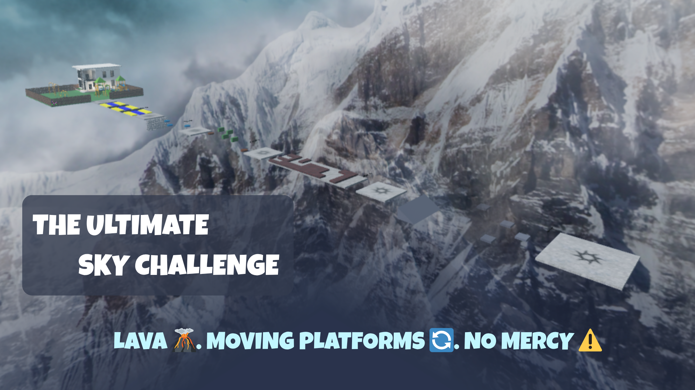
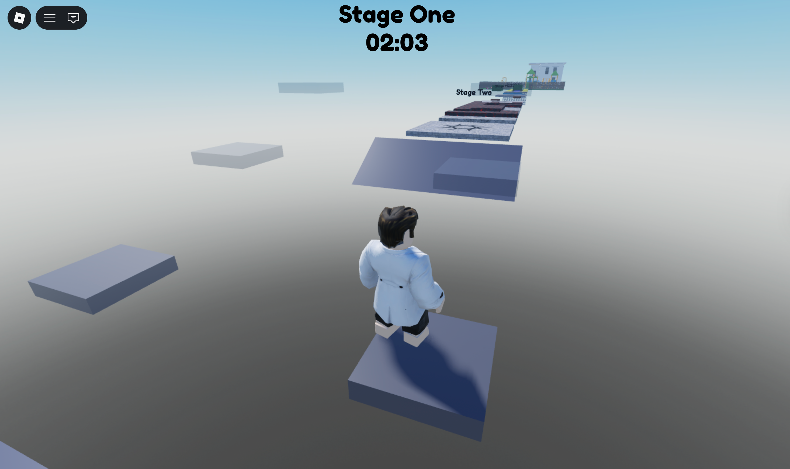
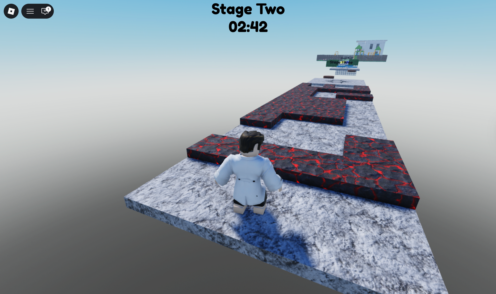
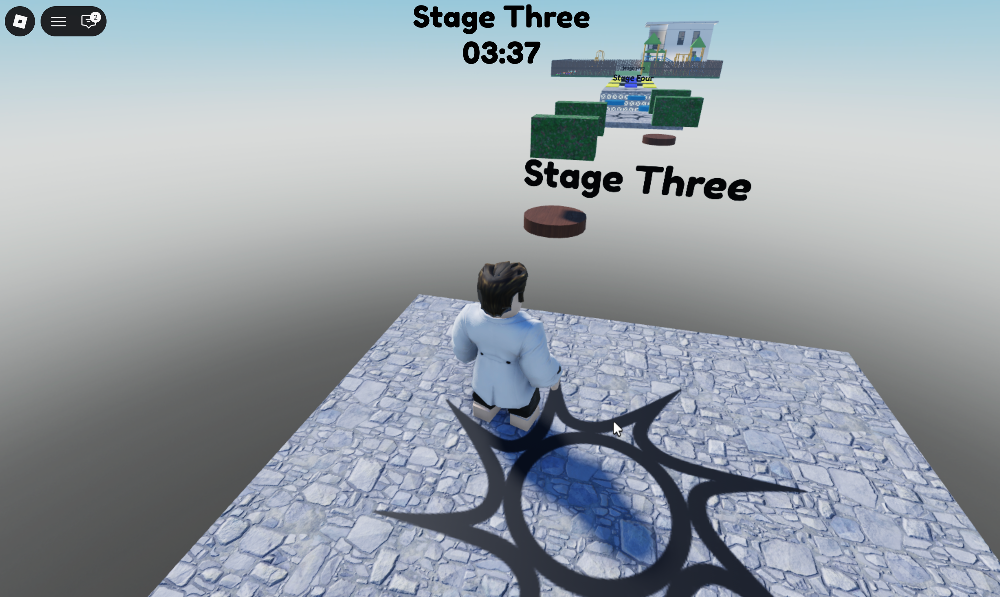
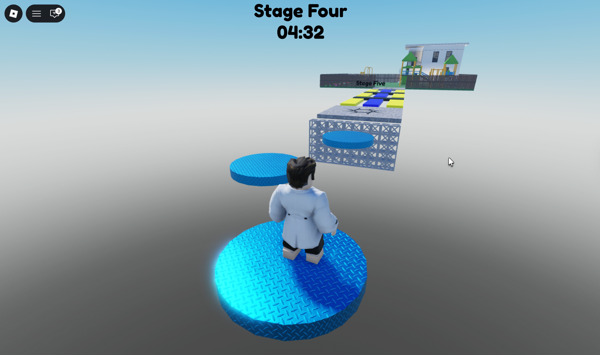
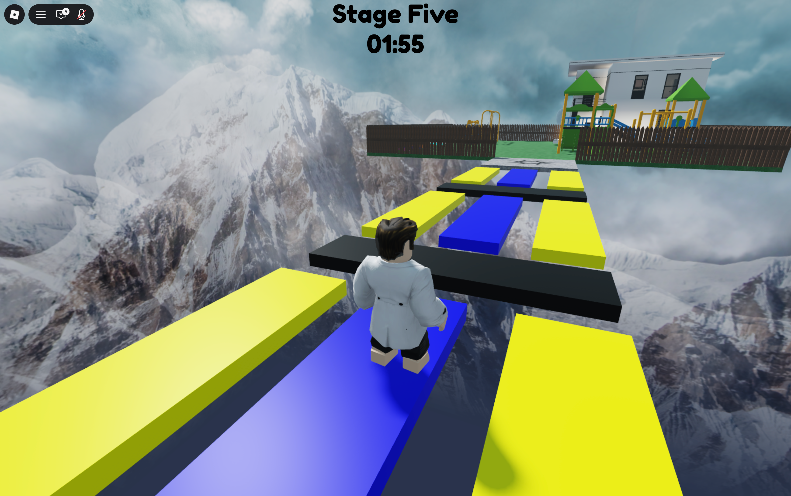
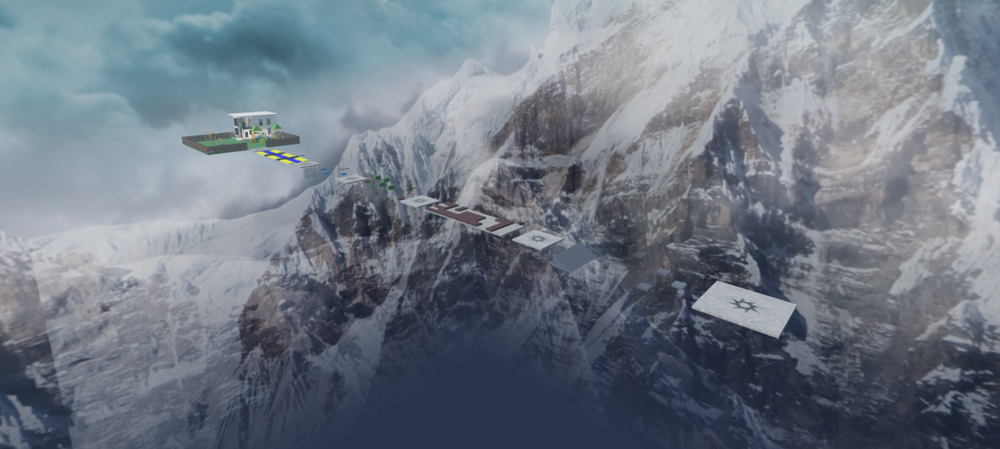

# 🎮 Sky Obby

A 5-stage obstacle course built from scratch using **Roblox Studio** and **Lua scripting**, set high above snowy mountains.



---

## 🕹️ Play the Game

🔗 [Play Sky Obby on Roblox](https://www.roblox.com/games/88370592311845/Sky-Obby)

---

## 📸 Screenshots

| Stage One | Stage Two |
|-----------|-----------|
|  |  |

| Stage Three | Stage Four |
|-------------|------------|
|  |  |

| Stage Five | Finish |
|------------|--------|
|  |  |

---

## 🗺️ Overview



---

## 🎯 Gameplay

Sky Obby has 5 stages, and each one hits different. You start easy with some classic platforms, then suddenly you're dodging lava, jumping on moving platforms, hopping across floating discs with nothing below you, and racing through color platforms that switch before you're ready. Make it through all that, and you reach the Finish: a house with a full backyard, playground, and swings. The Finish area also has a row of colored speed discs in the backyard; each one sets your walk speed to something different, from barely moving to flying across the grass. It's a good feeling when you get there.

### Stages Breakdown

| Stage | Challenge |
|-------|-----------|
| Stage One | Classic floating platforms |
| Stage Two | Lava maze — one wrong step and you're back |
| Stage Three | Moving platforms that keep you on your toes |
| Stage Four | Floating discs high in the sky with nothing below |
| Stage Five | Fast color platforms that switch before you're ready |
| Finish | A house with a backyard, playground, swings, and colored speed discs that each set your walk speed differently — from 1 all the way up to 500 |

---

## ⚙️ Technical Features

- **Server-side timer** — runs on the server using `RemoteEvents`, persists through player deaths and respawns
- **Team-based checkpoint system** — players always respawn at their last reached stage using Roblox Teams
- **Stage label UI** — live label updates as players progress through stages, powered by a LocalScript with `CharacterAdded` reconnection on respawn
- **Cross-platform support** — tested on PC, mobile, and tablet
- **GUI persistence** — `ResetOnSpawn` disabled so the HUD never disappears on death

---

## 🛠️ Built With

- [Roblox Studio](https://www.roblox.com/create)
- Lua scripting (Server Scripts + LocalScripts)
- Roblox Teams & SpawnLocations
- RemoteEvents (ReplicatedStorage)

---

## 📁 Project Structure

```
Sky Obby
├── Workspace
│   ├── StageOne
│   ├── StageTwo
│   ├── StageThree
│   ├── StageFour
│   ├── StageFive
│   └── Finish
├── ServerScriptService
│   ├── TeamSpawning     — handles team assignment on SpawnLocation touch
│   └── TimerServer      — runs the game timer and fires to the client via RemoteEvent
├── ReplicatedStorage
│   └── TimerSync        — RemoteEvent for server-to-client timer communication
└── StarterGui
    └── StageGui
        ├── LocalScript  — handles stage label updates and timer display
        ├── StageLabel   — displays current stage name
        └── TimerLabel   — displays elapsed time
```

---

## 👤 Author

**Rayane** — CS Student at Alma College  
[LinkedIn](https://www.linkedin.com/in/rayane-debbarh)

---

*This is my second Roblox game. Building it taught me a lot, from Lua scripting to client-server communication. Every bug pushed me to think differently, and that's honestly the best part.*
